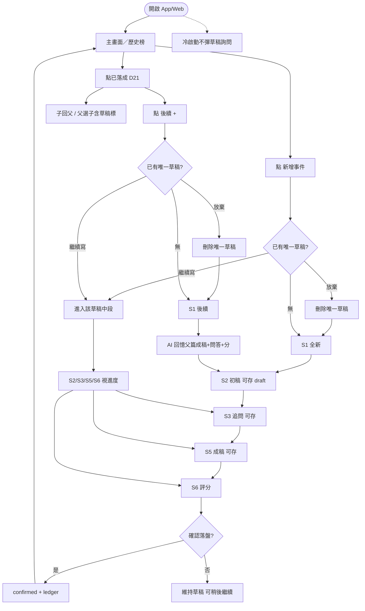

# 流程架構對照（產品 ⟷ CLI ⟷ Web UI）

> 更新：2026-07-19（含 D23 後續 + **草稿可存／再開詢問**）

---

## 1. 主路徑 + 後續 + 草稿

### 文字版

1. **全庫最多 1 份草稿**；**冷啟動不彈**詢問。  
2. 僅點「新增」或「後續 +」：有草稿 → **繼續寫**／**放棄後開新的**。  
3. 全新／後續可中途存；落盤才進歷史榜。  
4. 後續：銜接+新內容；回憶包；再評分；`續・`。  
5. 閱讀 D21；子回父；父選子。  
6. 第一版：先 Web；不做刪已落成；Merge 仍 CLI。

---

## 2. 三端對照

| 產品 | CLI | Web | 備註 |
|------|-----|-----|------|
| 草稿中途存 | 會寫 events | 會寫 | 與產品一致 |
| 草稿恢復詢問 | 未做 | **待做** | 新增／後續入口 |
| 後續鏈 | 未做 | 未做 | D23 |
| 主路徑 S1–S7 | ✅ | ✅ 起步 | |
| D21 | board 較雜 | 三塊 ✅ | |
| Merge | ✅ | 未做 | |

---

## 3. 對齊結論

主流程一致；**草稿可存 + 詢問繼續／放棄** 與「長文不能重打」一致且**可行**。  
後續鏈與詢問框 **待實作**。
